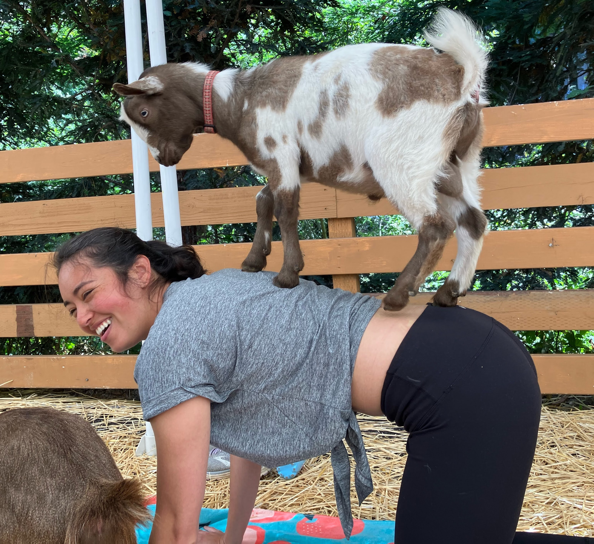
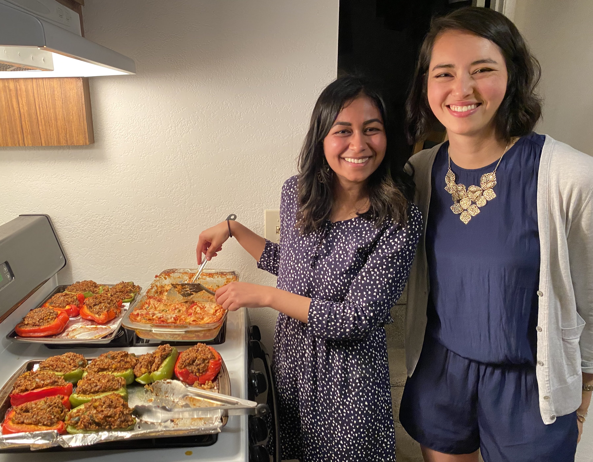
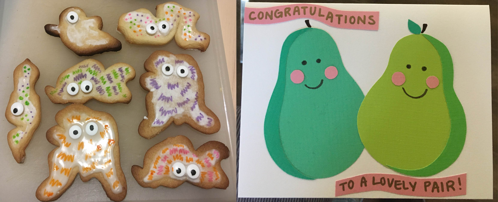
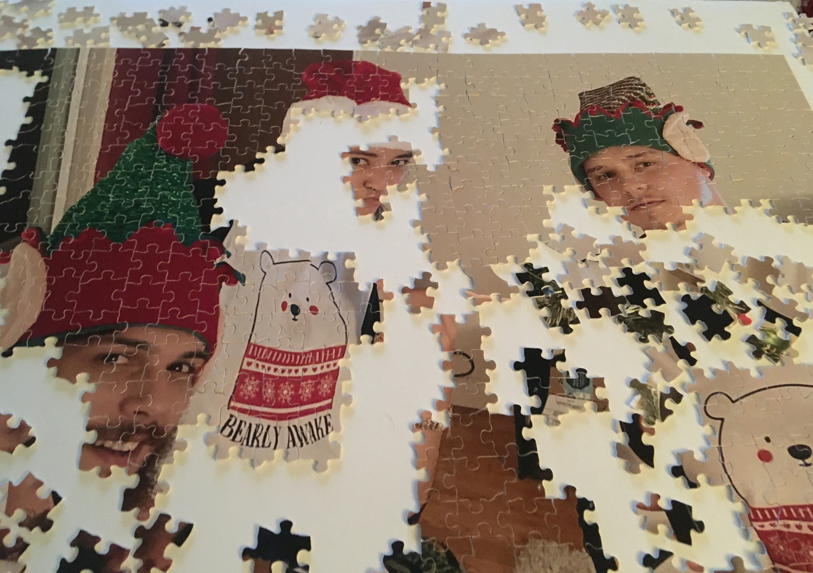

# My Personal Interests

My wellness is a big priority for me.
We cannot pour from an empty cup!
I practice vinyasa yoga regularly and even once took a yoga class with goats for my birthday.

I also enjoy cooking and have been known to pack my food in mason jars (and repurposed sour cream containers).
I prefer to make simpler, nourishing recipes that use whole ingredients.
Inviting friends over to share a meal, such as making many lasagnas and stuffed peppers for a Palentine's Day gathering, is also lovely! 

I like pursuing an assortment of creative odds and ends in my spare time.
Some recent examples include painting, baking and decorating unconventional cookies, and making paper cards!

When I have downtime, I also look forward to slowing down and resting. I can put my organizing skills to use with a puzzle or learn from others by reading a book or listening to a podcast. 
